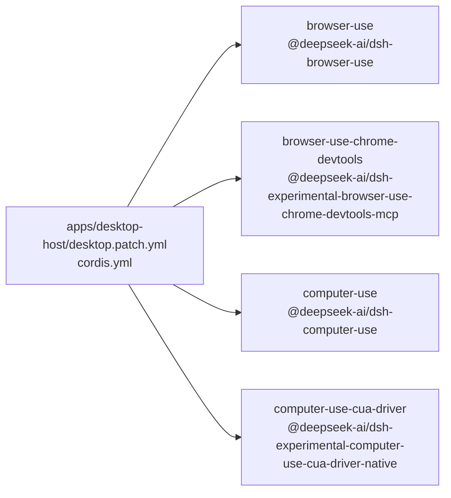

<!-- Generated by scripts/gen-doc-graphs.ts - do not edit by hand.
     Run `pnpm run gen-doc-graphs` to regenerate. -->

# Desktop Composition

The Desktop Host patch owns product restrictions and optional browser and computer-use providers after the base and web-app bundles load.

| Plugin id | Package / module |
| --- | --- |
| `browser-use` | `@deepseek-ai/dsh-browser-use` |
| `browser-use-chrome-devtools` | `@deepseek-ai/dsh-experimental-browser-use-chrome-devtools-mcp` |
| `computer-use` | `@deepseek-ai/dsh-computer-use` |
| `computer-use-cua-driver` | `@deepseek-ai/dsh-experimental-computer-use-cua-driver-native` |

Source config: [`apps/desktop-host/desktop.patch.yml`](../apps/desktop-host/desktop.patch.yml).

Maintenance mode: hybrid: the patch row list is parsed from its `cordis.yml`; app package expansion is curated from package source.
