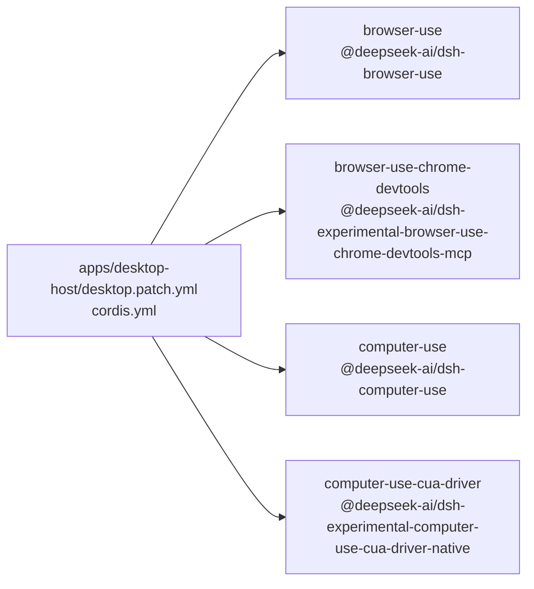

<!-- Generated by scripts/gen-doc-graphs.ts - do not edit by hand.
     Run `pnpm run gen-doc-graphs` to regenerate. -->

# Desktop 组合

[English](desktop-composition.md) | 中文

Desktop Host patch 在 base 与 web-app 组合包加载后配置产品限制，以及可选的浏览器操作与 computer use 提供方。

| 插件 id | 包／模块 |
| --- | --- |
| `browser-use` | `@deepseek-ai/dsh-browser-use` |
| `browser-use-chrome-devtools` | `@deepseek-ai/dsh-experimental-browser-use-chrome-devtools-mcp` |
| `computer-use` | `@deepseek-ai/dsh-computer-use` |
| `computer-use-cua-driver` | `@deepseek-ai/dsh-experimental-computer-use-cua-driver-native` |

配置来源： [`apps/desktop-host/desktop.patch.yml`](../apps/desktop-host/desktop.patch.yml).

维护方式：从 `cordis.yml` 解析 patch 行；应用包展开依据包源码维护。
