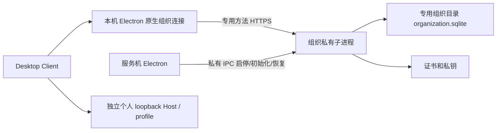

# 组织身份、事务与隔离设计

本文保存[实施计划](organization-foundation-plan.md)的身份、隔离与协议设计，并同步 Phase 1–7 的已实现接口。账号、私有 HTTPS 进程、项目授权、事件同步、GUI 与停服备份恢复已实现；真实三机产品验收尚未执行。

## 进程和数据所有权

Electron 是唯一进程所有者。组织子进程从 Desktop Host 发行根解析依赖，但加载独立 Cordis 配置，不加载个人 profile、Agent、Session、工具、附件、凭据或 Remote。组织库路径必须由服务机私有控制面传入，不能从网络请求指定；默认候选目录是 Merforge home 下 `organization-server`，不复用个人 storage。网络只携带组织记录，个人文件、路径、匿名安装标识和模型凭据没有导入接口。

状态：`disabled → starting → ready → stopping → disabled`；启动失败或异常退出进入 `failed`。默认关闭，随应用启动恢复服务是默认关闭的显式选项。TLS 和数据库均就绪后才报告 ready。停止先禁止新请求/订阅，再等待在途领域队列，关闭 TLS socket 和数据库，最后 IPC 确认退出。启动中取消也必须等待启动结算并释放已取得资源。Electron 完全退出、父进程 IPC 断开均收敛到停止；强杀后的 SQLite 恢复由 WAL 负责，不能把未确认操作当作成功。

## 包、编译面与真实消费者

| 所有者 | 编译面 | 定义、实现和消费者 |
| --- | --- | --- |
| `workspace/organization` | Host 单面 | 合并领域定义和 SQLite 实现，`ctx.organization`；Phase 2 Loader 测试消费真实持久操作，Phase 3 API/私有控制面接入 |
| `api/organization-api`（已实现） | Host | 专用 HTTPS 白名单路由调用领域方法；无通用 RPC 转发 |
| `host/organization-connection`（已实现） | Host | Electron 主进程持有连接对象、登录 token 和证书信任；固定方法访问远端 |
| `client/ui-organization`（已实现） | Client 插件 | typed locale 管理和模式入口，经限于 Desktop 顶层窗口的 typed preload IPC 消费组织连接；不持有私钥或组织令牌 |
| `apps/desktop`、`apps/desktop-host`（已实现） | 私有应用 | Electron 管理独立内部 Node 入口、配置、恢复和退出 |

不为各表拆包，不建立无人消费的抽象 provider。组织组合不挂载到个人默认 profile，不增加 package bin。Desktop Host manifest 已增加组织依赖与私有入口产物、在打包脚本核对闭包；入口 gate 继续禁止 bin/root launcher/shebang，若新增可执行源文件仅按精确路径登记内部角色，禁止整目录豁免。同步入口 gate 的负例测试，私有入口没有有效父 IPC 时拒绝启动。

## 身份和授权

跨进程 ID 使用 `Branded`：ServerId、AccountId、OrganizationId、MembershipId、InvitationId、OperationId、OrganizationProjectId、OrganizationCursor；LoginToken 与 InvitationToken 也不能互换。账号名是实例内唯一、转小写的 ASCII `[a-z0-9][a-z0-9_.-]{2,63}`；密码保留原文字符，不 trim，8–1024 字符。组织名 1–120 字符。实例 ID 与账号 ID 一起标识身份，不按用户名跨服务合并。

Account 含账号状态、密码摘要、版本；Membership 含组织、账号、`admin|member`、启用状态和版本，组织内账号唯一。首个账号是唯一服务恢复/账号管理员（bootstrap account）；组织管理员仅管理自己的组织。服务账号管理员可禁用其他账号；组织管理员不能凭组织身份影响该账号在其他组织的登录。禁用账号撤销全部登录；成员停用只影响该组织。任一组织始终保留至少一个启用账号下的启用管理员，禁止普通操作删去最后一个。管理权限不产生项目内容读取权限。

| 身份 | 登录/邀请注册 | 列出自身组织 | 成员、邀请、项目授权管理 | 项目读取/搜索/事件（Phase 4） | 全局账号禁用 |
| --- | --- | --- | --- | --- | --- |
| 未登录/失效登录 | 允许受限登录；注册需邀请 | 拒绝 | 拒绝 | 拒绝 | 拒绝 |
| 有效账号、有效成员 | 可登录；现有账号以会话接受邀请 | 仅有效 Membership | 仅 admin | 必须当前显式 grant | 拒绝 |
| 非项目成员 | 同上 | 同上 | 按组织角色 | 拒绝，包括总数和历史事件 | 拒绝 |
| 其他组织成员 | 同上 | 仅自己的组织 | 拒绝目标组织 | 拒绝目标组织 | 拒绝 |
| 组织管理员 | 同上 | 同上 | 允许本组织 | 仍必须 grant | 拒绝 |
| 首个服务账号 | 同上 | 同上 | 仍按 Membership | 仍必须 grant | 允许，但保留最后管理员 |

`authenticate(token, organizationId?, action)` 每次读持久账号、登录及 Membership；`member` 与 `manage` 是 Phase 2 动作。返回服务端生成的主体，不接收 actor/role。后续资源判断必须在同一同步事务内重新检查主体和 grant，不能缓存该返回值作为持久通行证。组织切换是选择有有效成员资格的 orgId，无服务端全局“当前组织”，不会改变个人任务归属。

## 数据库和提交

使用 Node `node:sqlite` 的 `DatabaseSync`，与现有 `storage-sqlite` 技术一致；Node >=22.19 与 Electron 44 的 Node runtime 支持。Node 为 MIT、内含 SQLite 为 public domain，无新增原生 addon。现有 `KvUnit` 仅承诺单次调用原子性，因此不复用其多次写入模拟组织事务。

组织库独占 `application_id` 和 `ORGANIZATION_SCHEMA_VERSION = 6`（SQLite `user_version`），独立于个人 Session 格式。已知 v1–v5 库在事务内补齐项目、WorkGraph 与分配表后升级；WorkGraph 表和授权规则见[组织任务设计](organization-workgraph.md)，分配、设备、租约及恢复失效规则见[组织分配协议](organization-assignment.md)。未盖章但非空的库、其他 application id、未知版本或非法持久记录均拒绝。使用 STRICT 表、外键、唯一索引、WAL、`synchronous=FULL`、`BEGIN IMMEDIATE`；同步事务体没有 await。服务队列包括密码计算，关闭先拒绝新工作再等队列清空。所有 mutation 在写锁内重新检查权限和版本；并发初始化/邀请由唯一记录和事务判定，不能创建第二套管理员。

表：`metadata`（实例、bootstrap account/org、恢复摘要）、`accounts`、`organizations`、`memberships`、`invitations`、`login_sessions`、`login_attempts`、`operation_receipts`、`organization_events`、`organization_projects`、`resource_grants`、`resource_events`。事件自增序号同时作为变更 revision；各实体 version 指向最近变更 revision。业务数据、事件、回执同事务提交；提交失败回滚全部，成功响应只在 COMMIT 后返回。失败登录计数也持久保存，进程重启不能绕过限流。审计事件不含密码、用户名、token 或项目正文。

有副作用的管理/注册操作携带随机 OperationId。回执按调用身份/邀请摘要/私有控制用途隔离，对规范化请求计算指纹：不含密码的请求使用 SHA-256，含密码的请求使用同成本 scrypt，盐由调用范围和随机 OperationId 派生。回执不提供比账号摘要更便宜的密码校验方式，计算均在 SQL 事务外完成。相同操作和请求返回同一回执，改变内容返回 `operation-conflict`。重放普通管理回执仍检查当前权限；已撤权调用者不能凭旧回执继续读。改密/退出后旧会话不能重试，但已提交回执保留。登录每次生成新 token，不承诺 token 重放；网络丢失可重新登录，先前会话按 TTL 失效。

邀请随机值由本机 Host 用 32 个随机字节生成并与请求 OperationId 一起保留到回执确认，因此重试返回同一回执而无需服务器保存邀请明文。领域层要求 43 字符 base64url token，库中仅存 SHA-256。邀请绑定组织、角色、到期时间和发起成员；消费时再次检查发起者仍是有效管理员。账号创建、邀请消费、Membership、事件、回执一起提交；已有账号使用登录会话接受邀请，不用注册覆盖原密码。

## 领域接口和失败

所有未知 JSON 字段拒绝。输入 ID 为 UUID，版本为非负安全整数，时间为毫秒。管理命令使用 `kind` 标签。

| 方法/命令 | 输入 | 输出/授权 |
| --- | --- | --- |
| `initialize` | operationId、username、password、organizationName、recoveryToken | 首个账号/组织/成员的 Receipt；仅私有 IPC，可同请求重试，其他初始化 `already-initialized` |
| `register` | operationId、invitationToken、username、password | Receipt；一次邀请注册新账号，原生连接随后使用本次凭据登录 |
| `login` | username、password | token、expiresAt、主体；错误密码/禁用统一 `invalid-credentials` |
| `logout` | 登录 token | 撤销当前登录；重复退出无副作用 |
| `execute/create-organization` | operationId、name | 有效账号创建组织并成为 admin |
| `execute/invite` | operationId、organizationId、role、invitationToken | 本组织 admin；Receipt，邀请 TTL 来自配置 |
| `execute/accept-invitation` | operationId、invitationToken | 有效账号加入另一组织；已有 Membership 拒绝 |
| `execute/set-membership` | operationId、organizationId、membershipId、expectedVersion、enabled、role | 本组织 admin；检查目标确属组织和最后管理员 |
| `execute/set-account` | operationId、accountId、expectedVersion、enabled | 服务账号管理员；最后管理员约束覆盖目标全部组织 |
| `execute/change-password` | operationId、currentPassword、newPassword | 本人校验旧密码，撤销该账号全部登录（包括当前） |
| `organizations` / `members` | token / token + organizationId | 自身有效组织列表 / admin 可见成员列表，安全视图无密码 |
| `recover` | operationId、recoveryToken、newRecoveryToken、newPassword | 仅私有 IPC，验证独立恢复凭证，恢复首账号及首组织 admin、轮换恢复凭证、撤销全实例登录 |

Receipt 包含 operationId、revision 及适用实体 ID，永不含秘密。初始化时 GUI 要求保存恢复凭证；无凭证不允许本地“免认证重置”。恢复是受独立一次性凭证授权的显式本机操作，不能从网络调用，也不能靠所在电脑自动取得账号权限。恢复后邀请仍按当前成员检查；备份恢复额外清空全部登录、使旧邀请失效、清空旧回执并轮换恢复凭证，避免回滚复活 token。

固定错误码：`invalid-input`、`incompatible-store`、`closed`、`already-initialized`、`not-initialized`、`invalid-credentials`、`rate-limited`、`unauthenticated`、`forbidden`、`invalid-invitation`、`username-taken`、`already-member`、`version-conflict`、`last-admin`、`operation-conflict`、`invalid-recovery`、`snapshot-required`。SQLite IO/约束异常不得直接传到网络；HTTPS 层统一映射 `unavailable` 并隐藏 SQL/路径。未知账号登录执行真实 dummy scrypt；错误、到期、消费过的邀请对外同码。

## 密码、TLS 和配置

密码使用 Node/OpenSSL scrypt（N=131072、r=8、p=1、16 字节随机盐、32 字节输出、约128 MiB），参数来自 OWASP 的 scrypt 最低建议，作为安全下限固定。异步计算使用 Node worker pool；验证用 `timingSafeEqual`，持久摘要包含版本和盐。服务串行排队限制同时计算；HTTPS 层在入队前实现有界并发、请求体和连接限流以阻止队列耗尽。

Phase 2 Config 必填专用数据库绝对路径；登录 TTL（默认8小时）、邀请 TTL（24小时）、限流窗口（15分钟）、每用户名尝试上限（5）、全服务窗口上限（100）、SQLite busy timeout（5秒）均经过正整数/范围验证。默认面向少量局域网用户；管理员可配置。用户名限流记录用摘要键，过期窗口在每次登录清理；全服务计数阻止随机用户名逃逸。其他部署选择由对应 Phase 3/5 Consumer Config 校验，领域不接受请求覆写 TTL。

已实现使用 `node:https` / `node:tls`，证书生成选 `selfsigned@5.5.0`（MIT，依赖 `@peculiar/x509` MIT / `pkijs` BSD-3-Clause，2026-09-26 npm 元数据已核对）。首版用 RSA-2048/SHA-256、自签 serverAuth 证书、随机序列号、SAN 含配置 IP/DNS，365天有效期；有效期和提前提醒天数作为配置，私钥0600。依赖已锁定，第三方 notices 已更新。实际证书生成发现 x509 与 ASN.1 类库使用不同 schema 注册表会失败，使用精确子依赖 override 将 x509 的 `@peculiar/asn1-schema` 统一到 2.9.5；Node/Electron Node mode smoke 已验证。使用已核对的异步 `generate(attrs, options)`，显式传入 `keySize`、`algorithm: sha256`、`notBeforeDate`、`notAfterDate` 和 `extensions`（含 SAN），避免库的 SHA-1 默认值。使用 Node X509Certificate 校验生成证书，不手写 ASN.1。

地址手填 `https://host:port`；不启用发现、不跟随重定向。首次仅无凭据探测证书，展示 SHA-256 DER 指纹，由用户通过服务机 GUI 核对后保存到本机 Host 信任记录。业务连接使用该证书专属 CA 和 hostname/SAN/有效期校验，同时核对指纹；不设全局 `NODE_TLS_REJECT_UNAUTHORIZED=0`。指纹变化、过期或主机名不符停止所有业务调用并清空登录/可见缓存。到期前服务机提示手动停服轮换证书，重启后各客户端重新核验；不自动接受新证书。服务 ID 只能在已信任连接后绑定。

## 内网路由允许清单（Phase 3–4）

协议前缀 `/organization/v1`，JSON 请求不接受 actor/role 注入认证主体。允许：`POST /login`、`POST /register`、`POST /logout`、`GET /organizations`、`GET /organizations/:id/members`、`POST /commands`（仅上表 execute 命令）、`GET /identity`（仅公开实例 ID 和协议版本）。资源接口包括 `POST /projects`、`POST /grants`、`GET /organizations/:id/projects`、`GET /projects/:id?organizationId=…`、`GET /projects/:id/grants?organizationId=…`（管理用版本信息，不返回项目名称）、`GET /organizations/:id/search`、`GET /organizations/:id/events`。初始化、恢复、服务设置、密钥、数据库、停服没有内网路由。未知路由/方法404/405；特别拒绝个人 `/api`、Session、附件、文件、下载、搜索和工具路径。

快照、总数、名称检索和历史/实时事件已共享当前授权 SQL。事务提交后事件才可交付；交付前重新检查权限，撤权后丢弃排队内容并关闭相关订阅。游标只指向持久事件，缺失范围要求重新快照。客户端可能已保存合法收到的历史内容，撤权不能远程抹除历史副本。

## 项目授权与同步（Phase 4 已实现）

`POST /projects` 支持 `create-project`（operationId、organizationId、name）和 `rename-project`（另需 projectId、expectedVersion）。创建需要组织管理权，同事务为创建成员写入显式 read/write grant；其他管理员不会自动获得读取权；重命名需要当前 `write` grant。`POST /grants` 的 `set-grant` 命令包含 operationId、organizationId、projectId、membershipId、expectedVersion、actions；actions 只允许 `read`/`write`，空列表撤权，首次 expectedVersion 为 0。成员和项目必须同组织；撤权记录保留版本，旧写入回执重放仍检查当前 grant。

列表/名称搜索返回 `{items,total,offset,revision,cursor}`；页大小由领域 Config 的 `pageSize` 控制（默认50）。详情只含组织项目 ID、组织 ID、名称和版本，不保存或接收个人 cwd、Session 或附件。搜索参数 `q` 为字面子串；SQLite 对 ASCII 忽略大小写。offset>0 必须携带首页 cursor；分页期间数据变化会要求重新获取快照。

事件采用持久失效通知 `{revision,projectId}`，不保存历史名称或正文。一次读取返回 `{from,cursor,revision,events}`；`stream=true` 是同一持久查询的 SSE 订阅，提交后唤醒并按配置轮询检查登录到期。每次交付均在领域队列中同步重验权限并写入 socket；只持有游标，不排队敏感内容，慢连接关闭。`followOrganizationEvents` 验证完整帧大小、游标链和递增事件版本；重复批次丢弃，乱序或缺口要求重新快照。

游标使用服务生命周期内随机 HMAC 密钥，绑定账号、组织、访问版本与已提交 revision。账号/成员/本人 grant 变化、伪造、跨身份、超出重放窗口或服务重启均要求新快照；不允许旧游标恢复已经撤销的访问。`eventBatchSize` 默认100个提交位置，`eventReplayWindow` 默认10000个位置；均可配置。SSE 默认16个订阅、1秒权限轮询、10分钟连接生命周期，完整帧受响应字节上限控制。原生连接已接入模式切换、请求代次与可见清理；协议通知不能抹去客户端已经保存的合法历史副本。

## GUI 交互（Phase 5–6）

服务机设置：关闭 → 配置地址/端口/目录 → 启用 → 首次创建账号和组织并保存恢复凭证 → 显示地址和证书指纹 → 管理成员、邀请和显式项目授权。服务未 ready 不显示“在线”。退出应用明确说明组织服务停止。

成员机：输入服务地址 → 核对指纹 → 接受邀请设置账号密码或已有账号登录后接受 → 登录 → 选择有效组织。个人/组织模式显示当前服务、身份和组织；缓存与在途请求以 server/account/org 隔离。切换取消旧订阅并用请求代次丢弃迟到响应。离线禁止组织写入，不排队副作用；重连重新认证和检查成员资格；退出/撤权清空可见组织数据。个人模式仍使用原本机数据和任务。

## 验证范围

Phase 2 使用真实 SQLite 临时目录、重开、写入故障、并发初始化/邀请、真实 scrypt、可控时钟、跨组织管理拒绝和 Loader 配置启动。没有前端页面、模型调用或独立服务器入口。普通 Node 与 Electron Node mode 的私有构建产物已验证 TLS、真实登录、项目授权、事件补发、撤权、重开和父 IPC 生命周期；Phase 7 产物验证通过，真实三机网络和 Desktop 可见验收仍待用户执行。

## 原生连接与维护（Phase 5–7 已实现）

`OrganizationConnection` 是合并定义与实现的本机连接库，真实消费者为 Electron 主进程；设置与 sidebar 经 `OrganizationDesktopBridge` 调用固定动作。沿用已经存在的 Electron 控制入口，未为个人 Host 添加组织代理。这调整了最初“Client → 本机 Host → LAN”的建议路径，令牌由本机原生连接持有，个人 Host 保持 loopback，组织服务不加载个人组合。信任记录保存在 `organization-client-trust.json`；登录令牌、用户名、服务身份、证书指纹和服务端到期时间通过系统安全存储加密，保存在独立的 `.login` 文件，绝不保存密码。Desktop 启动后在线核验会话和当前权限，再恢复可用状态；临时断网保留未过期凭据并重连。使用服务端配置的有效期（默认 8 小时），重启不续期；本机空闲期间也会自动清除到期会话。系统安全存储不可用或使用明文后端时仅支持内存登录。退出登录、证书失效和身份/组织切换清除可见项目并取消旧代次；断线禁止写入，重连重新验证登录与成员资格。

未确认的写入持久化 server/account/organization/operation ID 和可选设备登记/撤销动作类型，不含令牌或正文。`GET /organization/v1/receipts/:operationId` 检查当前账号及相关管理/资源权限后返回其自己的回执或 null；原生 `reconcile` 只查询，不重发副作用。原生进程仍运行时可以取回暂存的邀请明文；重启后明文已丢弃，管理员在确认旧邀请提交后可另发新邀请。证书与回执日志均为本机 owner-only 文件。

GUI 服务配置保存在 `organization-server-settings.json`，组织库固定在独立 `organization-server` 子目录。默认关闭，`restoreOnLaunch` 默认 false；设置保存和启动失败不影响个人 Host。服务机应将实际局域网 IP/DNS 加入证书 names。运行时持有目录旁的 `organization-server.owner.sqlite` EXCLUSIVE 锁，重复 writer 或维护者拒绝；进程强杀后由 OS 释放锁，不依赖删除 stale PID 文件。

当前组织 schema 为 v12；停服备份写 v12，恢复接受经校验的 v2–v11 并在 staging 升级。v11 API 执行 JSON 保持原字节；v12 的显式 Codex 策略和调度元数据见[执行协议](organization-execution.md)。停服备份只写新目录，包含 `organization.sqlite`、`tls-identity.json`、严格版本/hash manifest。恢复先在 staging 校验文件类型、格式、hash、完整性、外键、持久记录与 TLS 密钥配对，再撤销登录与邀请、轮换恢复凭证并追加 `restore` 审计。完成后原目录保留为 `.previous-<uuid>`，最终替换失败尝试原位回滚。备份包含组织密码摘要及证书私钥，须按敏感文件保存。没有个人文件、个人 API key 或聊天迁移；不支持在线热备份、云同步或自动升级。证书轮换只能停服后通过本机显式操作触发，各客户端需重新比对指纹。

[验收剧本](organization-foundation-acceptance.md)分别记录自动化工程证据和用户侧三机待验项。产品下一阶段应继续在组织领域/受限 API/连接动作/组织 UI 接入共享项目与 WorkGraph，不把个人 Agent loop 改成多租户执行器。

## 组织架构

当前 SQLite 版本为 v15；v14 升级增加 organization_hierarchy，不改变成员身份与版本。组织成员通过固定 GET `/organizations/:id/hierarchy` 读取成员 ID、姓名、角色、启用状态、直属上级和层级版本，不返回账号 ID 或凭据。普通成员只看到启用节点，管理员可看到停用节点。

管理员通过 `set-supervisor` 和观察到的版本更新直属上级或根节点。循环、自己作为上级、跨组织及停用上级均拒绝。层级本身不授予项目内容访问权，分配规则详见[任务分配](organization-assignment.md#组织层级与分发权限)。组织模式沿用 Projects、Bots、Recent 与 Tasks 的导航位置，填充当前身份的组织记录；个人与组织对话、Bot 配置均隔离。

组织与个人使用同一套 Session 主面板、Chat/Trajectory 消息组装、输入框、模型选择和侧栏会话菜单。切换身份只替换分区数据和授权传输；成员层级与权限仍由组织权威服务维护。组织任务由对话规划生成，旧手动创建任务工作台入口已移除。分配通知同步全部分页，为当前员工创建私有节点会话，以 Agent 名义解释目标并选中节点；不复制领导私聊，也不自动接受或执行。任务分配及执行设置在主区域的任务详情中操作。会话删除保留禁止重建的持久标记。
